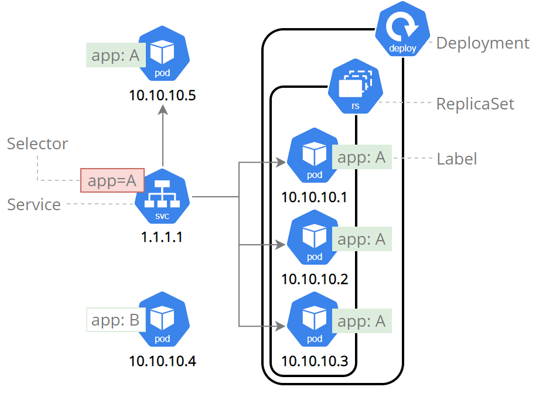
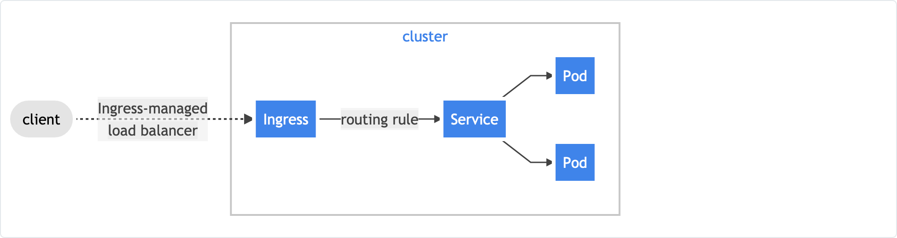

# k8-tutorial-overview

### Kube tutorial

These tutorials look to cover the basics of Kubernetes so that you can perform the basic tasks in a Kubernetes cluster!

There are several exercises to help cover the points raised during this overview that help cover a the practical elements of the Kubernetes architecture. 

### So, what is Kubernetes

Kubernetes is a “container orchestration system”, or in their own words:

“***Kubernetes is a portable, extensible, open-source platform for managing containerised workloads and services, that facilitates both declarative configuration and automation. It has a large, rapidly growing ecosystem. Kubernetes services, support, and tools are widely available.***”

Originally designed and developed by Google, it is now maintained by the Cloud Native Computing Foundation. 

To understand more about the benefits of Kubernetes (K8), we can see how things have progressed over time (again, thanks to the wonderful K8 concept pages)

This new way of working provides significant benefits over a “bare metal”, or “traditional” approach, namely around the concept of loosely coupled software development practises.

### Doesn’t Docker do this already?

Yes, sort of. Docker has Docker Swarm which is also a “container orchestration system”, and given Docker is nearly always the containerisation technology of choice, why isn’t everyone using this?

  
Well, this likely comes back to the principle identified above, loose coupling.

### K8 vs Swarm

Kubernetes entire architecture is incredibly modular, from how your nodes (servers) talk to one another, to the containerisation technology used, monitoring tools, the works! Swarm provides a lot of the functionality Kubernetes does, just not quite at the same scale, nor with anywhere near the same level of flexibility.

Given this scope for customisation, Kubernetes tends to find itself fitting more naturally into large, operation environments running complex software distributions, whilst Swarm for more ad-hoc, small scale deployments.

The major difference however between the two is K8’s scope for the automatic scaling of services running within the cluster; something that Swarm, manual intervention is required to achieve. Users in K8’s can use the CPU/Memory demands of a container to inform K8 to increase or decrease the number of running instances, or alternatively, the containers own custom metrics (from the application running inside) to inform that decision.

There are many other differences we could cover here, but overall, in a simple, controversy causing analogy: K8 is to an Enterprise Linux Server that Docker Swarm is to a Windows Server deployment. Both achieve a lot of the same functionality, but one is going to require you to do things exactly their way, and therefore, may not get used in the same type of scenarios the other would.

### K8 nomenclature

Within Kubernetes there are various concepts and principles that bind all of the numerous components and services together. Below, we explore what some of the most common terms you
are likely to come across when interacting with a K8 cluster:

#### [Pods](https://kubernetes.io/docs/concepts/workloads/pods/)

Pods are the smallest deployable units of computing that you can create and manage in Kubernetes.

A Pod (as in a pod of whales) is a group of one or more containers, with shared storage and network resources, and a specification for how to run the containers. 
A Pod's contents are always co-located and co-scheduled, and run in a shared context. It is analogous to two "traditional" applications running on the same machine.

#### [Nodes](https://kubernetes.io/docs/concepts/architecture/nodes/)

Kubernetes runs your workload by placing containers into Pods (see below) to run on Nodes. A node may be a virtual or physical machine, depending on the cluster. 
Each node is managed by the control plane and contains the services necessary to run Pods.

Typically you have several nodes in a cluster; in a learning or resource-limited environment, you might have only one node (such as [minikube](https://minikube.sigs.k8s.io/docs/start/)).

The components on a node include the kubelet, a container runtime, and the kube-proxy (details for each can be found in the next section).

#### [Namespaces](https://kubernetes.io/docs/concepts/overview/working-with-objects/namespaces/)

Namespaces are intended for use in environments with many users spread across multiple teams, or projects.

Namespaces provide a scope for names. Names of resources need to be unique within a namespace, 
but not across namespaces. Namespaces cannot be nested inside one another and each Kubernetes resource 
can only be in one namespace.

Namespaces are a way to divide cluster resources between multiple users (via resource quota).

#### [Services](https://kubernetes.io/docs/concepts/services-networking/service/)

An abstract way to expose an application running on a set of Pods as a network service.

Kubernetes gives Pods their own IP addresses and a single DNS name for a set of Pods, and can load-balance 
across them.

Services simply point to pods using labels. Since services are not node-specific, a service can point to a pod 
regardless of where it runs in the cluster at any given moment in time. By exposing a service IP address as well as a 
DNS service name, the application can be reached by either method as long as the service exists.

There are various different "flavours of service" that can be found in a Kubernetes cluster:

###### Headless

Services that do not need load balancing and only expose a single IP can create a ‘headless’ service by specifying “none” as the clusterIP.

Headless services can be defined with selectors, in which case endpoint records are created in the API that modify the DNS 
to return addresses that point to pods that are exposing the service. Headless services without selectors don’t 
create endpoint records. The DNS system configures either the CNAME record or a record for endpoints with the same name as the service.

###### NodePort

NodePorts are open ports on every cluster node. Kubernetes will route traffic that comes into a 
NodePort to the service, even if the service is not running on that node. NodePort is intended as a 
foundation for other higher-level methods of ingress such as load balancers and are useful in development.

###### ExternalName

ExternalName services are similar to other Kubernetes services; however, instead of being accessed via a clusterIP address,
it returns a CNAME record with a value that is defined in the externalName: parameter when creating the service.

###### Load Balancer

For clusters running on public cloud providers like AWS or Azure, creating a load LoadBalancer service provides an equivalent to a 
clusterIP service, extending it to an external load balancer that is specific to the cloud provider. 
Kubernetes will automatically create the load balancer, provide firewall rules if needed, and populate the service with the 
external IP address assigned by the cloud provider.

#### [Deployments](https://kubernetes.io/docs/concepts/workloads/controllers/deployment/)

A Deployment provides declarative updates for Pods and ReplicaSets.

You describe a desired state in a Deployment, and the Deployment Controller changes
the actual state to the desired state at a controlled rate. You can define Deployments to 
create new ReplicaSets, or to remove existing Deployments and adopt all their resources with new Deployments.

Deployments are essentially the unit of currency used to define the installation of software and services installed
into the Kubernetes cluster.

#### [Replica Sets](https://kubernetes.io/docs/concepts/workloads/controllers/replicaset/)

A ReplicaSet ensures that a specified number of pod replicas are running at any given time. 

A Deployment is a higher-level concept that manages ReplicaSets and provides declarative updates to Pods along with a lot of other useful features. 

It is strongly recommended using Deployments instead of directly using ReplicaSets, unless you require custom update orchestration
or don't require updates at all (a very unusual scenario).

#### [Ingresses](https://kubernetes.io/docs/concepts/services-networking/ingress/)

Ingress exposes HTTP and HTTPS routes from outside the cluster to services within the cluster. 
Traffic routing is controlled by rules defined on the Ingress resource.

Here is a simple example where an Ingress sends all its traffic to one Service:

An Ingress may be configured to give Services externally-reachable URLs, load balance traffic, terminate SSL / TLS, and 
offer name-based virtual hosting. An Ingress controller is responsible for fulfilling the Ingress, usually with a load balancer, 
though it may also configure your edge router or additional frontends to help handle the traffic.

An Ingress does not expose arbitrary ports or protocols. Exposing services other than HTTP and HTTPS to the internet typically uses a 
service of type `Service.Type=NodePort` or `Service.Type=LoadBalancer`.

### Exercises

There are two exercises you can now complete that look to cover the points and concepts raised so far:

* [Tutorial 1](https://github.com/fat-potato-uk/k8s-demo-1): This looks to cover a local installation of K8s (via Minikube)
followed up by a series of exercises against it
  
* [Tutorial 2] (https://github.com/fat-potato-uk/k8s-demo-2): This looks to go further into the concepts covered above as
well as use of tools like Helm

### Kube.config

### K8 Components

-> API Server (Node Roles)
-> etcd
-> DNS
-> Kubelet
-> kube-proxy

### K8 Commands

-> List of commands

Tutorial 3

